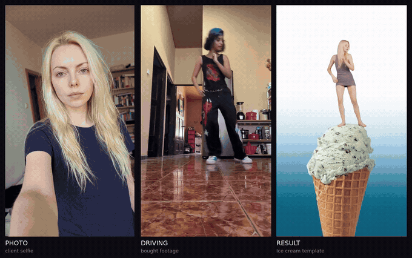

# Lip-sync templates

[](https://github.com/greenflac/lipsync-templates/actions/workflows/ci.yml)

The user uploads a selfie, picks a template, and gets a vertical video with
sound where they are the person on screen.



<sub>Left to right: the client's selfie · the driving footage · the finished
video. One template ("Ice cream"), 10 seconds, real speed. The same clip
**with sound**: [showcase_icecream.mp4](docs/video/showcase_icecream.mp4).</sub>

---

The repository contains two tools.

**The generation pipeline** turns a selfie into a finished video in eight
stages. Seven of them are free checks that run before the one paid call, so
most defects are caught on a still image for a fraction of a cent instead of
on a rendered video for a dollar.

**The template builder** is for the person who designs templates: they write a
prompt, feed in a stock demo person, and get back a style reference (an
"aesthetic") that is ready to sell as a template. Building a new template
takes one run.


<sub>The first six templates. One demo person, six aesthetics, four different
driving videos.</sub>

**Presentation:** [English (PDF)](docs/deck/lipsync_en.pdf) ·
[по-русски (PDF)](docs/deck/lipsync_ru.pdf)

---

## Numbers

| | |
|---|---|
| `$0.70` | cost of a 10-second video; the `$0.07/s` rate was confirmed by four separate balance measurements |
| `720×1280` | the model returns exact 9:16, so assembly crops nothing |
| `300 frames` | all six videos came out at exactly 10.0 seconds |
| `0 cuts` | no edit seams inside any of the six videos |

## How it works

```
1  driving intake        cuts, scene length, window         free
2  aesthetic             prompt + demo person               cents
3  aesthetic check       demo identity still there          free
4  reference assembly    client photo + aesthetic           cents
5  reference check       face leak, framing, composition    free
6  video generation      Kling Motion Control               $0.07/s
7  assembly              9:16, sound, duration              free
8  final check           human review                       free
```

Every check returns one of three outcomes: `pass`, `fail`, or `could not
measure`. The third one is never silently converted into the other two, and
every verdict comes with its numbers: how many items were checked, how many
failed, how many could not be measured. Zero failures out of zero checks is
reported as exactly that, not as success.

## Integration

The pipeline logic is not tied to a specific backend or video model.

Every outward call — the model, file uploads, storage — is passed in as a
parameter. That is also why the test suite covers the whole path without
touching the network.

The acceptance checks don't care where their input came from, so they can sit
in front of an existing pipeline as a standalone quality-control layer.

Switching the video model means replacing one call. Kling's current limits
(3-second minimum, unstable frame-by-frame output) belong to the model, not to
the approach: another API model, or an open-source model on your own GPUs,
lifts them.

## Choosing driving footage

The driving video is the only input that gets bought, so its requirements are
a purchasing checklist:

- **Face at least 100 px tall.** Below that the identity can't be measured and
  the model transfers it poorly. Measured: faces of 34–56 px drifted, faces of
  85–139 px held.
- **A single scene with no cuts.** A cut inside the selected window becomes a
  visible shot change in the finished video.
- **A scene longer than the product duration.** The window is cut from the
  middle of the longest scene.
- **The person stays in frame.** The driving's framing is carried into the
  aesthetic prompt, because the model takes the pose from the video.

Lip-sync footage is the hardest case, especially when the actor turns around:
during the turn the face leaves the frame entirely.

## Tests

```
python -m unittest discover -s lipsync/tests -p "test_*.py"
```

770 tests, no network, no GPU. Each one guards a specific defect that
actually happened — the test name says which one. Decision thresholds are
covered by mutation: changing a threshold in either direction makes tests
fail.

## Licence

The source is public so it can be read and audited, but this is **not** open
source: using, copying or embedding it requires an agreement. See
[LICENSE](LICENSE).

One more thing worth knowing: the identity check uses InsightFace `buffalo_l`
weights, which are licensed for non-commercial use. As shipped, the acceptance
layer is a development tool; a commercial deployment would swap the face model
and recalibrate the thresholds.

---

# Липсинк-шаблоны

Пользователь загружает селфи, выбирает шаблон и получает вертикальный ролик со
звуком, где снимается он сам.


<sub>Слева направо: селфи клиента · драйвинг · готовый ролик. Один шаблон
(«Мороженое»), 10 секунд, реальная скорость. Тот же ролик **со звуком**:
[showcase_icecream.mp4](docs/video/showcase_icecream.mp4).</sub>

---

В репозитории два инструмента.

**Пайплайн генерации** превращает селфи в готовый ролик за восемь ступеней.
Семь из них — бесплатные проверки перед единственным платным вызовом, поэтому
большинство дефектов ловится на картинке за доли цента, а не на готовом видео
за доллар.

**Сборщик шаблонов** — для того, кто шаблоны придумывает: он пишет промт,
подаёт стоковую демо-личность и получает стилевой референс («эстетику»),
готовый к продаже как шаблон. Новый шаблон собирается за один прогон.


<sub>Первые шесть шаблонов. Одна демо-личность, шесть эстетик, четыре разных
драйвинга.</sub>

**Презентация:** [по-русски (PDF)](docs/deck/lipsync_ru.pdf) ·
[English (PDF)](docs/deck/lipsync_en.pdf)

---

## Числа

| | |
|---|---|
| `$0.70` | стоимость ролика на 10 секунд; ставка `$0.07/с` подтверждена четырьмя независимыми замерами баланса |
| `720×1280` | модель возвращает ровно 9:16, сборка ничего не обрезает |
| `300 кадров` | все шесть роликов вышли ровно по 10.0 секунды |
| `0 склеек` | ни в одном из шести роликов нет монтажных швов |

## Как это работает

```
1  приём драйвинга      склейки, длина сцены, окно          бесплатно
2  эстетика             промт + демо-личность               центы
3  проверка эстетики    демо-личность на месте              бесплатно
4  сборка референса     фото клиента + эстетика             центы
5  проверка референса   утечка лица, план, композиция       бесплатно
6  генерация видео      Kling Motion Control                $0.07/с
7  сборка               9:16, звук, длительность            бесплатно
8  финальная проверка   смотрит человек                     бесплатно
```

Каждая проверка возвращает один из трёх исходов: `годно`, `не годно` или
`не смогли проверить`. Третий никогда молча не превращается в первые два, и
рядом с каждым вердиктом стоят его числа: сколько проверено, сколько не
прошло, сколько не удалось измерить. Ноль нарушений при нуле проверок
печатается именно так, а не как успех.

## Встраивание

Логика пайплайна не привязана ни к конкретному бэкенду, ни к видеомодели.

Каждый внешний вызов — модель, загрузка файлов, хранилище — передаётся
параметром. Поэтому же тесты проходят весь путь, не выходя в сеть.

Проверкам приёмки всё равно, откуда пришёл вход: их можно поставить перед
любым существующим пайплайном как отдельный слой контроля качества.

Смена видеомодели — замена одного вызова. Нынешние ограничения Kling (минимум
3 секунды, нестабильная покадровая выдача) относятся к модели, а не к подходу:
другая модель по API или опенсорсная на своих GPU их снимает.

## Как выбирать драйвинг

Драйвинг — единственный вход, который покупается, поэтому требования к нему —
это чек-лист закупки:

- **Лицо не меньше 100 px.** Ниже личность нечем измерить, и модель переносит
  её плохо. Замерено: лица 34–56 px поплыли, лица 85–139 px удержались.
- **Одна сцена без склеек.** Склейка внутри выбранного окна становится
  видимой сменой плана в готовом ролике.
- **Сцена длиннее продуктовой длительности.** Окно вырезается из середины
  самой длинной сцены.
- **Человек не выходит из кадра.** План драйвинга переносится в промт
  эстетики, потому что позу модель берёт из видео.

Липсинк — самый сложный материал, особенно когда актёр разворачивается: на
развороте лицо полностью уходит из кадра.

## Тесты

```
python -m unittest discover -s lipsync/tests -p "test_*.py"
```

770 тестов, без сети и без GPU. Каждый сторожит конкретный дефект, который
действительно случился, — имя теста называет какой. Пороги принятия решений
покрыты мутациями: сдвиг порога в любую сторону роняет тесты.

## Лицензия

Исходники открыты, чтобы их можно было прочитать и проверить, но это **не**
open source: использование, копирование и встраивание требуют договорённости.
См. [LICENSE](LICENSE).

Ещё одно, о чём стоит знать: проверка личности использует веса InsightFace
`buffalo_l`, а они лицензированы только для некоммерческого применения. В
поставляемом виде слой приёмки — инструмент разработки; коммерческое
развёртывание заменит модель лица и перекалибрует пороги.
